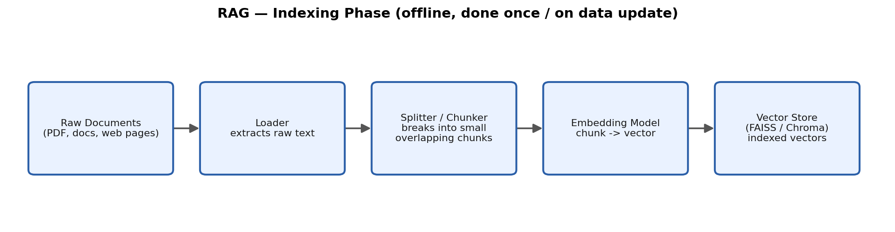
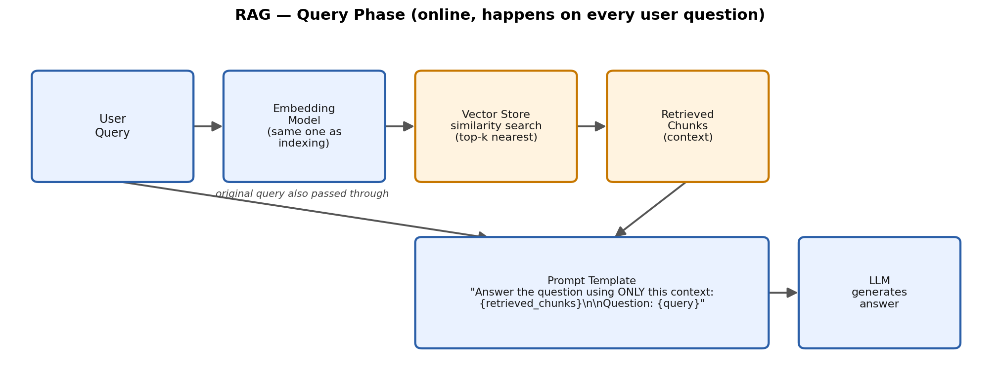

# Understanding RAG: Retrieval-Augmented Generation

## Why RAG exists

An LLM only "knows" what was in its training data, frozen at some cutoff date. Two problems
follow directly from that:

1. **It can't answer questions about your private/recent data** — some internal
   docs, a recently uploaded PDF, today's news. None of that was in training data.
2. **It hallucinates confidently** when it doesn't actually know something, because nothing
   stops it from generating plausible-sounding text either way.

RAG's fix is simple in concept: **before** asking the LLM to answer, first *retrieve* the
most relevant pieces of real, trusted text from your own documents, and hand those to the
LLM as context, with an instruction to answer *using that context* rather than its own
memory. The LLM still does the writing, but the facts come from documents you control.

## The two phases

RAG pipelines split cleanly into an **offline indexing phase** (done once, or whenever your
documents change) and an **online query phase** (done on every single user question).

### Phase 1 : Indexing (build the searchable index)

| Step | What happens | Why it's needed |
|---|---|---|
| **Loader** | Extracts raw text from PDFs, Word docs, web pages, databases, etc. | Documents come in messy formats; you need plain text to work with. |
| **Splitter / Chunker** | Breaks long text into small, overlapping chunks (e.g. 500-1000 characters, with ~10-20% overlap between chunks) | Embedding models and LLM context windows have size limits, and retrieval works better when each chunk is about ONE self-contained idea rather than a whole 50-page document. Overlap prevents cutting a key sentence in half between two chunks. |
| **Embedding Model** | Converts each chunk of text into a vector (a list of numbers, e.g. 384 or 1536 dimensions) | This is what makes "search by meaning" possible — semantically similar text produces nearby vectors, regardless of exact wording (see `vector_search_faiss_chroma.py`). |
| **Vector Store** | Indexes all those vectors (FAISS, Chroma, Pinecone, etc.) for fast nearest-neighbor lookup | Comparing a query against millions of chunks one-by-one would be too slow; vector stores use specialized indexing structures (e.g. HNSW, IVF) to make this fast even at scale. |

### Phase 2 : Query (answer a real question)

| Step | What happens | Why it's needed |
|---|---|---|
| **User Query** | The actual question someone asks | The starting point. |
| **Embedding Model** | The query is embedded with the **same** embedding model used during indexing | Query and document vectors must live in the same vector space to be comparable — mixing embedding models breaks similarity search. |
| **Vector Store similarity search** | Finds the top-k chunks whose vectors are closest to the query vector | This is the "retrieval" in Retrieval-Augmented Generation — it narrows millions of words down to just the handful of chunks actually relevant to this question. |
| **Retrieved Chunks (context)** | The raw text of those top-k chunks | This becomes the "evidence" the LLM is allowed to use. |
| **Prompt Template** | Combines the retrieved chunks + original query into one prompt, usually with an instruction like *"answer using ONLY the following context"* | This is where retrieval and generation actually connect — it's just a `ChatPromptTemplate` like the ones from the week2, with the retrieved text injected as a variable. |
| **LLM** | Generates the final answer grounded in the provided context | The LLM still does the reasoning/writing, but now it's reading from real source text instead of guessing from memory. |

## Key design decisions (things worth experimenting with later)

- **Chunk size & overlap** : too small loses context, too large dilutes relevance and wastes
  tokens. There's no universal right answer; it depends on document type.
- **How many chunks to retrieve (top-k)** : more chunks = more context but more noise and
  higher cost; too few risks missing the answer entirely.
- **Similarity metric** : cosine similarity vs Euclidean (L2) distance vs dot product; most
  embedding models are trained/optimized for one specific metric.
- **Retrieval strategy** : plain top-k similarity vs MMR (Maximal Marginal Relevance, which
  also optimizes for *diversity* among results, avoiding 5 near-duplicate chunks) vs hybrid
  search (combining keyword/BM25 search with vector search, catches exact-match cases like
  product codes or names that embeddings sometimes miss).
- **What the vector store update strategy is** : do you re-index everything nightly, or
  incrementally add/update vectors as documents change?

## What "grounding" actually buys you

Because the final prompt explicitly contains retrieved source text, RAG gives you two things
a plain LLM call doesn't:

1. **Answers can cite/reflect real, current, private data** : not just training-data knowledge.
2. **Reduced (not eliminated) hallucination** : the model has real text to lean on instead of
   inventing facts, though it can still misread or misuse the retrieved context.